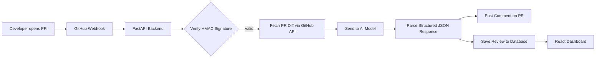

# PR Roaster

AI-powered GitHub PR reviewer that automatically analyzes pull requests and posts structured feedback — critical issues, warnings, and suggestions — as a comment, within seconds of the PR opening.

**Live Demo (GCP Cloud Run):** https://pr-roaster-backend-1017399742306.asia-southeast1.run.app
**Live Demo (AWS EC2):** http://13.212.169.213:8000
**GitHub:** https://github.com/shaznamuees1-dev/pr-roaster


---

## What It Does

1. A developer opens a Pull Request on a repo with PR Roaster installed
2. GitHub sends a webhook event to the FastAPI backend
3. The backend verifies the request is genuinely from GitHub using HMAC-SHA256 signature validation
4. It fetches the PR diff via the GitHub API
5. The diff is sent to an LLM with an engineered prompt requesting structured JSON output
6. The AI returns a roast score (0–100), summary, critical issues, warnings, and suggestions
7. PR Roaster posts this as a formatted comment directly on the PR
8. The review is saved to a database and displayed on a React dashboard

---

## Architecture



---

## Tech Stack

| Layer | Technology |
|---|---|
| Backend | FastAPI (Python) |
| Frontend | React (Vite) |
| Database | SQLite + SQLAlchemy |
| AI Integration | LLM API with prompt engineering |
| Containerization | Docker (multi-stage builds) |
| CI/CD | GitHub Actions |
| Cloud (1) | AWS EC2 |
| Cloud (2) | GCP Cloud Run |

---

## Key Features

- **Secure webhooks** — HMAC-SHA256 signature validation ensures only genuine GitHub requests are processed
- **Structured AI output** — engineered prompts force consistent JSON responses (roast score, critical issues, warnings, suggestions)
- **Persistent review history** — every review is stored and viewable via a React dashboard
- **Multi-cloud deployment** — same Docker image deployed independently to AWS EC2 and GCP Cloud Run
- **Automated CI/CD** — every push to `main` runs tests, builds a Docker image, and auto-deploys to GCP Cloud Run via GitHub Actions

---

## Local Setup

### Backend
```bash
git clone https://github.com/shaznamuees1-dev/pr-roaster.git
cd pr-roaster
python -m venv venv
venv\Scripts\activate          # Windows
pip install -r requirements.txt
uvicorn app.main:app --reload
```

### Frontend
```bash
cd frontend
npm install
npm run dev
```

### Environment Variables
Create a `.env` file in the root:
```
GITHUB_WEBHOOK_SECRET=your_webhook_secret
GITHUB_TOKEN=your_github_personal_access_token
GROQ_API_KEY=your_ai_api_key
```

### Docker
```bash
docker-compose up --build
```

---

## Deployment

### AWS EC2
Deployed via Docker Compose on an Ubuntu EC2 instance, with security groups configured for ports 8000 (API) and 5173 (frontend).

### GCP Cloud Run
Deployed via GitHub Actions using a scoped service account. Automatically rebuilds and deploys from source on every push to `main`.

```bash
gcloud run deploy pr-roaster-backend \
  --source . \
  --region asia-southeast1 \
  --allow-unauthenticated
```

---

## API Endpoints

| Method | Endpoint | Description |
|---|---|---|
| GET | `/` | Health check |
| POST | `/webhook` | GitHub webhook receiver |
| GET | `/reviews` | Returns all stored PR reviews |

---

## What I Learned

- Building and securing a GitHub App with webhook signature validation
- Prompt engineering for reliable structured (JSON) LLM output
- Multi-stage Docker builds for smaller, production-ready images
- Debugging real deployment issues — CORS, volume mounts, IAM permissions, security groups
- Setting up CI/CD pipelines that deploy to multiple cloud providers from a single codebase

---

## Author

**Shazna Muees**
Software Engineer
[GitHub](https://github.com/shaznamuees1-dev) · [LinkedIn](https://www.linkedin.com/in/shaznamuees/)
